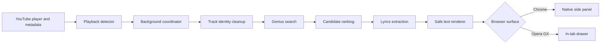

# Murmur

Murmur is a Manifest V3 browser extension that detects the song playing on YouTube or YouTube Music, finds the best available Genius lyrics result, and presents the lyrics in a clean reader beside the video.

The current release is **Murmur v0.7.0** for Google Chrome and Opera GX.

> This repository is the public distribution and documentation home for Murmur. It intentionally does not contain the development source tree. The downloadable extension packages still contain the runtime HTML, CSS, JavaScript, and manifest required by the browser, so they can be inspected after download.

## Download

| Browser | Package | Reader experience |
| --- | --- | --- |
| Google Chrome 114+ | [Download Murmur for Chrome](releases/murmur-chrome-v0.7.0.zip) | Native Chrome side panel, with an in-tab fallback |
| Opera GX | [Download Murmur for Opera GX](releases/murmur-opera-gx-v0.7.0.zip) | Closeable drawer attached to the current YouTube tab |

Checksums are published in [SHA256SUMS.txt](releases/SHA256SUMS.txt). See [Release verification](docs/RELEASES.md) before installing a package obtained from anywhere other than this repository.

**Testing status:** Opera GX has been manually exercised for the primary flow. The Chrome package shares the validated runtime and passes automated package checks, but the owner had not yet completed a full manual Chrome installation test when v0.7.0 was assembled.

## What Murmur Does

- Detects playback on `youtube.com`, mobile YouTube, and YouTube Music.
- Reads the visible title, channel or artist, media ID, and playback state.
- Cleans common YouTube labels such as `Official Audio`, `Visualizer`, and featured-artist suffixes.
- Searches Genius and ranks title-and-artist candidates.
- Uses the best valid result instead of blocking on a confidence threshold.
- Extracts the lyrics as text and renders them inside Murmur's own white, stone, slate, and black interface.
- Notices playlist, autoplay, navigation, and metadata changes so the reader follows the next song.
- Keeps the reader attached to the browser instead of opening a detached lyrics window.
- Stores only the on/off and auto-open preferences.

## Install In Chrome

1. Download [the Chrome ZIP](releases/murmur-chrome-v0.7.0.zip).
2. Extract the ZIP to a permanent folder. Do not load the ZIP itself.
3. Open `chrome://extensions`.
4. Turn on **Developer mode**.
5. Select **Load unpacked**.
6. Choose the extracted folder that contains `manifest.json`.
7. Pin Murmur from Chrome's Extensions menu if you want one-click access.

For screenshots, update steps, and common installation mistakes, read the [complete installation guide](docs/INSTALLATION.md).

## Install In Opera GX

1. Download [the Opera GX ZIP](releases/murmur-opera-gx-v0.7.0.zip).
2. Extract the ZIP to a permanent folder.
3. Open `opera://extensions`.
4. Turn on **Developer mode**.
5. Select **Load unpacked**.
6. Choose the extracted folder that contains `manifest.json`.
7. Pin Murmur from the Extensions menu if desired.

Opera GX receives its own package because Chrome's native `sidePanel` manifest entry is not used there. Murmur instead creates a fixed, closeable drawer inside the active YouTube tab.

## Use Murmur

1. Open a song on YouTube or YouTube Music and begin playback.
2. Select the Murmur toolbar icon.
3. Turn **Murmur is on** on.
4. Select **Open lyrics**.
5. Close the reader with its X button or the `Escape` key.
6. Leave **Open when a new song starts** enabled if you want the reader to follow playlist and autoplay changes automatically.

Murmur displays the best result it can identify. The title shown under **Lyrics** tells you which Genius result was selected, and **View source** opens that result on Genius for verification.

## How It Works

The extension is split into small responsibilities: a page detector observes YouTube, a background coordinator owns per-tab state and preferences, a lyrics pipeline searches and extracts text, and a reader renders only locally created elements. The [architecture guide](docs/ARCHITECTURE.md) maps every part and the [implementation walkthrough](docs/HOW_IT_WORKS.md) explains the process step by step without publishing the full development source tree.

## Documentation

- [Installation](docs/INSTALLATION.md)
- [User guide](docs/USER_GUIDE.md)
- [Architecture](docs/ARCHITECTURE.md)
- [How the implementation works](docs/HOW_IT_WORKS.md)
- [Privacy and permissions](docs/PRIVACY.md)
- [Troubleshooting](docs/TROUBLESHOOTING.md)
- [Frequently asked questions](docs/FAQ.md)
- [Release and checksum verification](docs/RELEASES.md)
- [Source visibility and distribution model](docs/SOURCE_VISIBILITY.md)
- [Security policy](SECURITY.md)
- [Support](SUPPORT.md)
- [Changelog](CHANGELOG.md)

## Current Limitations

- Murmur depends on the current YouTube and Genius page structures. Either site can change its markup.
- Genius can rate-limit or reject a request, and some songs do not have a usable lyrics page.
- The best-available-result behavior favors showing a result over refusing uncertain matches. Verify unusual songs with the displayed match label and source link.
- Developer-mode extensions must be updated manually by replacing their files and reloading the extension.
- Lyrics remain the property of their respective rights holders. Murmur does not bundle a lyrics catalog.

## Privacy

Murmur has no analytics, advertising, account system, proxy, or project-operated server. Track metadata is processed in the browser. Lyrics searches and page requests go directly from the browser to Genius. Read the complete [privacy document](docs/PRIVACY.md).

## Contributing And Support

This distribution repository accepts documentation fixes, bug reports, compatibility reports, and feature proposals. It does not expose the development source tree, so implementation pull requests are not expected here. Start with [CONTRIBUTING.md](CONTRIBUTING.md) or [SUPPORT.md](SUPPORT.md).

## License

Murmur is distributed under the [MIT License](LICENSE). Third-party websites, page content, brands, and lyrics are governed by their respective owners and terms.
