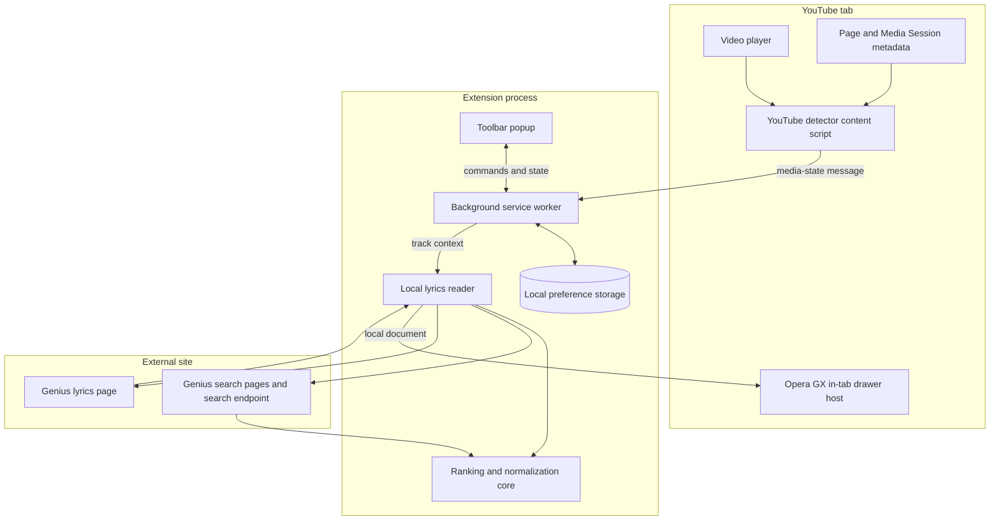
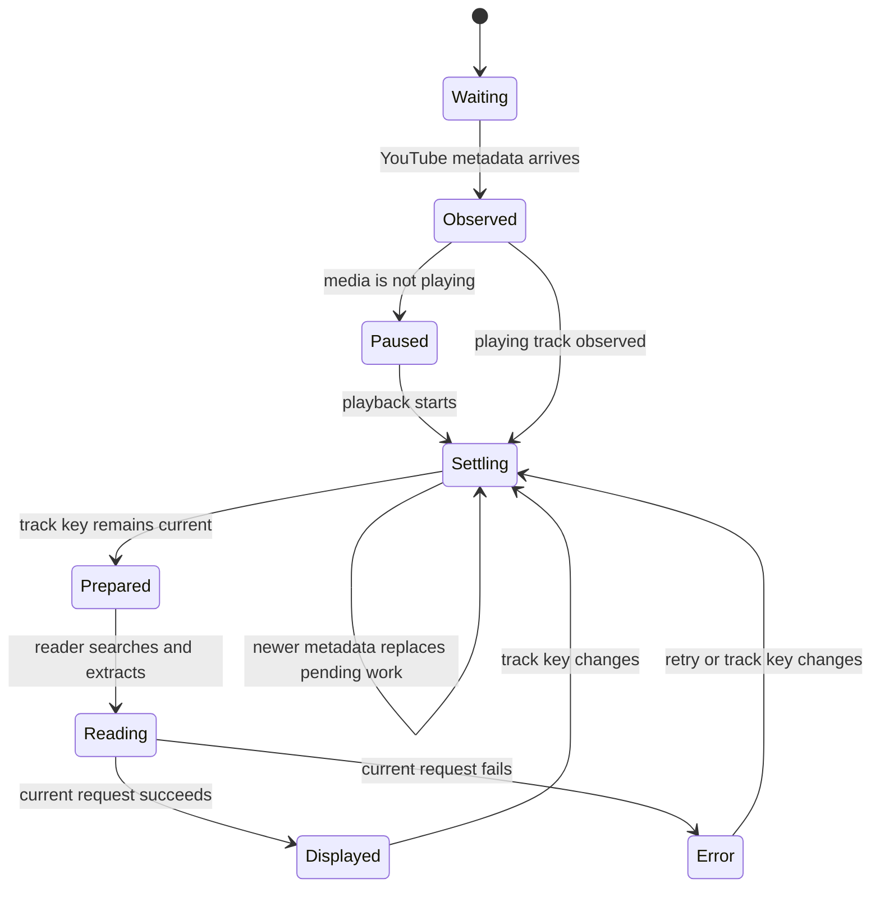
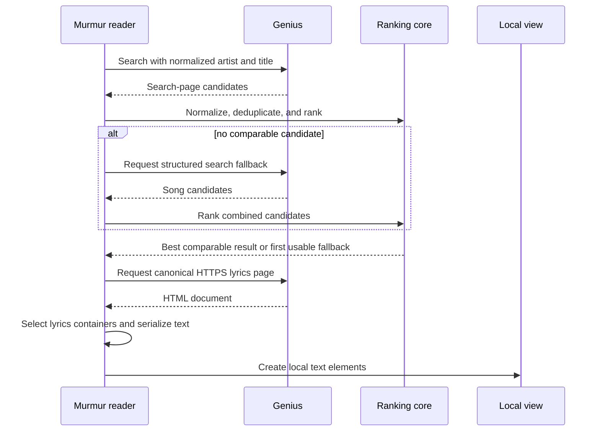

# Project Architecture

This document explains Murmur's runtime architecture without publishing the private development source tree. It names the major components, their responsibilities, the data they exchange, and the safeguards around the lyrics pipeline.

## System Goal

Murmur turns a changing YouTube page into a stable lyrics-reading experience. It must solve four separate problems:

1. Detect what is actually playing inside a single-page application.
2. convert inconsistent video metadata into a useful song identity.
3. Find and extract a reasonable lyrics result without executing third-party page code.
4. Keep a browser-attached reader synchronized when the song changes.

## High-Level Components



## Runtime Layers

### 1. Manifest And Browser Capabilities

Both packages use Manifest V3 and declare only the hosts needed for YouTube detection and Genius requests. The shared runtime contains the same detector, coordinator, reader, styles, and assets.

The manifests differ intentionally:

| Capability | Chrome package | Opera GX package |
| --- | --- | --- |
| `sidePanel` permission | Yes | No |
| `side_panel` manifest entry | Yes | No |
| In-tab drawer files | Included as fallback | Included as primary reader host |
| YouTube and Genius host access | Yes | Yes |

The local reader document is the only extension page exposed as a web-accessible resource, and only to the supported YouTube origins. Supporting scripts and styles remain extension-internal.

### 2. YouTube Detector

The detector runs at `document_idle` on desktop YouTube, mobile YouTube, and YouTube Music. It has two jobs:

- Observe enough browser and page signals to notice track changes reliably.
- Send a small, normalized media snapshot to the background worker.

It reads the video element, YouTube title and channel elements, YouTube Music player-bar elements, Media Session metadata when available, the current URL, and the YouTube media ID.

The detector does not fetch lyrics and does not store history.

### 3. Background Coordinator

The Manifest V3 service worker is the extension's traffic controller. It owns:

- Per-tab media snapshots.
- Per-tab track keys.
- Per-tab prepared reader context.
- Auto-search timers.
- The two persisted preferences.
- Browser-surface selection and recovery.

Most data is held in memory through maps keyed by tab ID. When a tab closes, that tab's timers and records are removed.

### 4. Popup Controller

The popup is a thin control surface. It requests the current state, displays the current track, updates the two preferences, asks for a fresh detection, and opens the appropriate reader surface.

It refreshes periodically and also reacts to state-change broadcasts. It does not perform lyrics scraping itself.

### 5. Lyrics Core

The lyrics core is a set of deterministic helpers used by the reader. Its responsibilities are:

- Normalize title and artist text.
- Validate and canonicalize Genius lyrics URLs.
- Recognize song hits from the Genius search response.
- Deduplicate candidates.
- Score comparable title-and-artist results.
- Select the best valid candidate or the first usable fallback.
- Normalize extracted lyrics whitespace.
- Identify DOM elements that must not enter the lyrics output.

Keeping these rules separate makes them easier to validate without running a browser UI.

### 6. Lyrics Reader

The reader is a local extension page. It receives the current track context, searches Genius, retrieves a lyrics page, converts selected DOM nodes to text, and renders new local elements.

It has four explicit states:

- Empty.
- Loading.
- Error with retry.
- Lyrics.

The reader tracks request identity and aborts stale network work when the song changes.

### 7. Browser Presentation

Chrome uses the native side-panel API when possible. Opera GX hosts the same reader document inside a fixed iframe drawer created by Murmur on the current YouTube page.

The Opera drawer:

- Is fixed to the right edge.
- Uses a 440-pixel maximum width.
- Adapts to narrow viewports.
- Sits above YouTube using a high stacking level.
- Slides in and out without resizing the YouTube document.
- Can be closed with its header button or `Escape`.

## Data Model

Murmur passes small plain objects between layers. The conceptual models are shown below.

### Media Snapshot

```text
url
mediaId
title
cleanTitle
artist
channel
playing
audible
currentTime
duration
observedAt
tabId and windowId, added by the coordinator
trackKey and timing metadata, added by the coordinator
```

### Track Identity

```text
title
artist
query = artist + title when both are useful
```

### Reader Context

```text
extension version
source tab ID
active-tab summary
settings
media snapshot
prepared result metadata
track identity
track key
```

### Candidate

```text
title
artist
canonical Genius lyrics URL
optional computed match score
```

## Message Boundary

Components communicate with named extension messages instead of sharing page variables.

| Message | Direction | Purpose |
| --- | --- | --- |
| `MURMUR_MEDIA_STATE` | Detector to coordinator | Store the newest YouTube media snapshot |
| `MURMUR_COLLECT_NOW` | Coordinator to detector | Request an immediate media snapshot |
| `MURMUR_GET_STATE` | Popup to coordinator | Read settings, active tab, media, and prepared result |
| `MURMUR_GET_LYRICS_CONTEXT` | Reader to coordinator | Read context for a specific source tab |
| `MURMUR_UPDATE_SETTINGS` | Popup to coordinator | Change enabled or auto-open preferences |
| `MURMUR_DETECT_ACTIVE` | Popup to coordinator | Refresh metadata from the active YouTube tab |
| `MURMUR_SEARCH_ACTIVE` | Popup to coordinator | Prepare the active track for the reader |
| `MURMUR_GET_READER_URL` | Drawer host to coordinator | Build a reader URL tied to the source tab |
| `MURMUR_SHOW_INLINE_READER` | UI or coordinator to drawer | Open the in-tab reader |
| `MURMUR_TOGGLE_INLINE_READER` | UI to drawer | Toggle the in-tab reader |
| `MURMUR_HIDE_INLINE_READER` | UI to drawer | Close the in-tab reader |
| `MURMUR_STATE_CHANGED` | Coordinator broadcast | Ask open extension views to refresh |
| `MURMUR_CLOSE_INLINE_READER` | Embedded reader to drawer host | Close from the reader's X button |

## Track-Change State Machine



The short settling delay exists because YouTube can update the video element, URL, title, channel, and Media Session metadata at slightly different moments.

## Search And Selection Pipeline



## Security And Privacy Boundaries

Murmur follows these boundaries:

1. Genius candidate URLs must use HTTPS, use the Genius host, and end in a lyrics-page path.
2. Remote scripts are never injected into the extension UI.
3. Remote HTML is parsed in memory, and only selected lyrics nodes are traversed.
4. Scripts, styles, buttons, SVG content, hidden nodes, and Genius blocks marked for exclusion are ignored.
5. Lyrics are inserted with text properties into locally created elements, not with remote HTML injection.
6. Fetches omit credentials and bypass browser cache for fresh search and lyrics responses.
7. The reader cancels stale requests so an old song cannot replace the current song's display.
8. Only enabled state and auto-open state are persisted.

## Failure Boundaries

Each layer can fail independently:

- YouTube markup changes can prevent metadata extraction.
- A content script can be absent from a tab opened before installation; the coordinator attempts reinjection.
- Genius search markup or response shape can change.
- Genius can reject, rate-limit, or omit a request.
- A valid result can still be the wrong song when metadata is ambiguous.
- The browser can deny panel opening outside a user gesture.

The UI exposes retry and source verification instead of hiding those conditions.

## Repository Distribution Model

This public repository stores documentation and signed-by-checksum release ZIPs. It does not store the development tree as browseable Git files. This limits casual source browsing on GitHub, but it is not a secrecy boundary: browsers require unpacked runtime files, so recipients can inspect the package. See [Source visibility](SOURCE_VISIBILITY.md).

